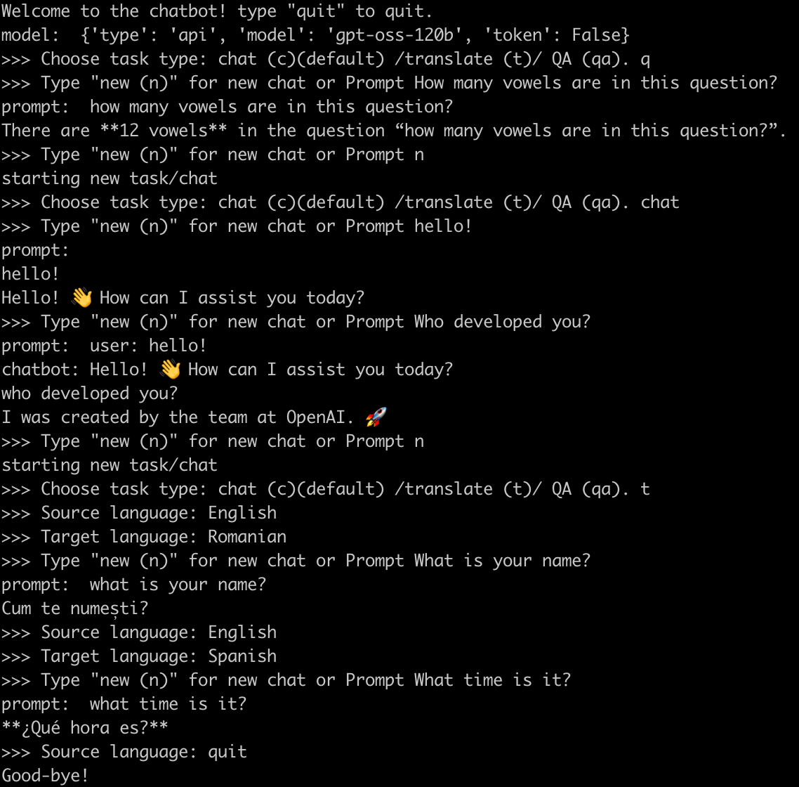

# LING4467 Assignment 1: Chatbot

## Install/Setup
Developed in `Python 3.11.11`

```sh
python3 -m venv venv
source venv/bin/activate
pip install -r requirements.txt
```

For the API-based models I used [Cerebras](https://inference-docs.cerebras.ai/introduction)

Create a `.env` file in root and put in your huggingface token and Cerebras token. It should look something like this:

```
hf_token=HF_TOKEN
cerebras_token=CEREBRAS_TOKEN
```

## Run
If you want to run the full eval, in `chatbot.py` set `mode="eval"`.
To run in "chatbot" mode (command line interface where you type in tasks and prompts), run with `mode="chat"`
In chatbot mode, swap out model object as desired.
An example of the chatbot mode:


## Author
Emma Rafkin: epr41@georgetown.edu
