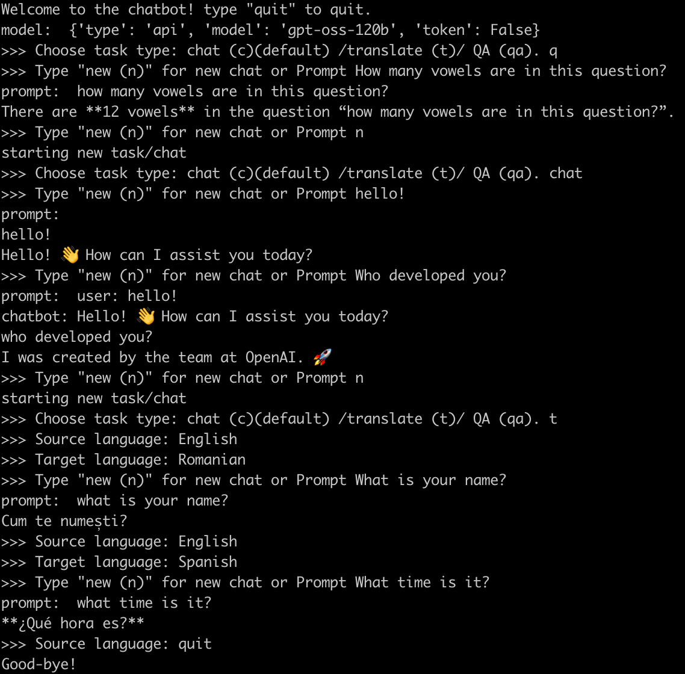
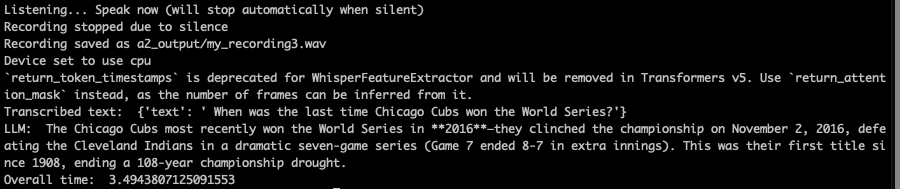

# LING4467 Assignment 1: Chatbot

## Install/Setup
Developed in `Python 3.11.11`

```sh
python3 -m venv venv
source venv/bin/activate
pip install -r requirements.txt
```

For the API-based models I used [Cerebras](https://inference-docs.cerebras.ai/introduction)

Create a `.env` file in root and put in your huggingface token and Cerebras token. It should look something like this:

```
hf_token=HF_TOKEN
cerebras_token=CEREBRAS_TOKEN
```

The whole chatbot pipeline can be run if via the `record_audio_to_llm_pipeline` method in `audio_io.py`.

## Assignment 1: Chatbot
### Run
If you want to run the full eval, in `chatbot.py` set `mode="eval"`.
To run in "chatbot" mode (command line interface where you type in tasks and prompts), run with `mode="chat"`
In chatbot mode, swap out model object as desired.
An example of the chatbot mode:


## Assignment 2: Audio IO
The code for assignment 2 is in the `audio_io.py` file. This file contains methods to save, load, and playback audio files, as well as record from the microphone. Additionally, you can load audio files and run an ASR model (`whisper-tiny`) as well as run a method to speak directly into the microphone and have an LLM respond to your speech. Finally, there is also a method to create specrograms. 


## Assignment 3: Whisper Assessmnet
The code for assignment 3 can be found in `whisper_assessment.py`. This script loads in 100 samples from 3 datasets: Librispeech, Fleurs (Swedish only), and a dataset that I created. That dataset can be found zipped up in the folder `dataset`. Code for generating this dataset is in `create_dataset.py`. The whisper assessment script has 3 methods, one to test all 8 models on all the data, one to rerun the three best on a GPU, and one to run the three best using Faster Whisper. 


## Assignment 4: TTS
The first part of the assignment involves running Meta's EnCodec model to look at compression rates/success. Code for this can be found in `codec.py`. This script looks for files in a folder called `a4_input/codec`, encodes the audio, and then decodes it at various codebook amounts. Stats for each file/audio compression will be output in a csv called `stats.csv`

The second part: I tested 6 TTS models on 16 prompts. Latency and A/B testing results can be found in `a4_output`. Scripts for running the models on the prompts can be found in `tts.py` while the script for the A/B testing (along with the results from when I accidentally killed it half way through) can be found in `tts_eval.py`.
## Author
Emma Rafkin: epr41@georgetown.edu
